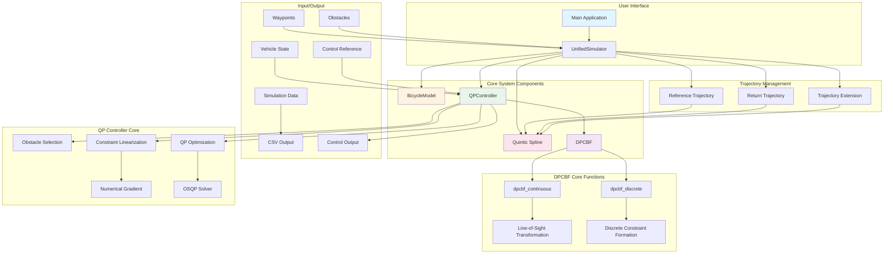
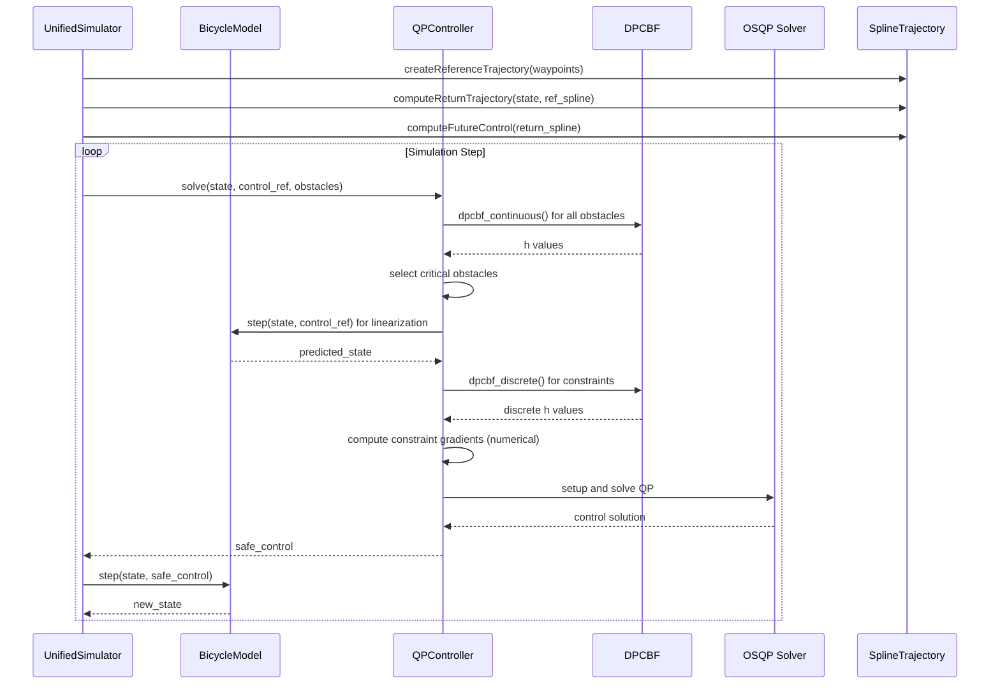

# Dynamic Parabolic CBF System Architecture

## Overview
This document describes the architecture of the Dynamic Parabolic Control Barrier Function (DPCBF) system for safe navigation of autonomous vehicles in dynamic environments.

## System Architecture Diagram

## Component Interaction Flow

## Key Design Patterns

### 1. Component-Based Architecture
The system is organized into modular components that handle specific responsibilities:
- **BicycleModel**: Handles vehicle kinematics and basic control functions
- **DPCBF**: Implements the Dynamic Parabolic Control Barrier Function logic
- **QPController**: Manages the safety-critical optimization problem
- **SplineTrajectory**: Handles trajectory generation and interpolation
- **UnifiedSimulator**: Coordinates all components for the simulation

### 2. Observer Pattern
The system uses parameter structures to configure components:
- `DPCBFParams`: Configures DPCBF behavior (k_lambda, k_mu, margin)
- `QPWeights`: Configures QP objective (tracking, jerk penalties)
- `DiscreteCBFConfig`: Configures discrete constraint parameters

### 3. Strategy Pattern
Different simulation scenarios use different configuration strategies:
- Straight line scenario with highway-like obstacle patterns
- Intersection scenario with complex maneuvering requirements

## DPCBF Mathematical Foundation

The Dynamic Parabolic CBF (DPCBF) defines a time-varying safe set based on:
`h(x) = v_x + λ(x) * v_y² + μ(x) ≥ 0`

Where:
- `v_x`: Relative velocity in the line-of-sight direction
- `v_y`: Relative velocity perpendicular to line-of-sight
- `λ(x)`: Adaptive curvature parameter that changes with distance and relative velocity
- `μ(x)`: Adaptive safety margin parameter

The parameters λ and μ adapt dynamically:
- As distance to obstacle increases → parameters increase (allows more maneuvering)
- As relative velocity increases → λ decreases (allows more lateral movement)

## Safety Architecture

The safety architecture implements multiple layers:

1. **Primary Safety**: DPCBF constraints ensure collision avoidance
2. **Constraint Relaxation**: Slack variables ensure QP feasibility
3. **Control Limits**: Physical limits prevent dangerous control inputs
4. **Jerk Limiting**: Smooth transitions prevent actuator damage

## Performance Considerations

- **Real-time Capability**: QP formulation designed for real-time solution
- **Obstacle Selection**: Only critical obstacles included to limit computational complexity
- **Numerical Stability**: Epsilon terms prevent division by zero
- **Caching**: Previous control inputs cached for jerk computation